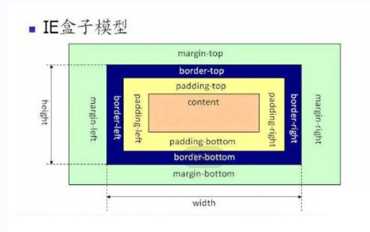

# CSS篇

#### 1. CSS选择器及其优先级

|     选择器     |     格式      | 优先级权重 |
| :------------: | :-----------: | :--------: |
|    id选择器    |      #id      |    100     |
|    类选择器    |  .classname   |     10     |
|   属性选择器   | a[ref=“url”]  |     10     |
|   伪类选择器   | li:last-child |     10     |
|   标签选择器   |      div      |     1      |
|  伪元素选择器  |   li:after    |     1      |
| 相邻兄弟选择器 |     h1+p      |     0      |
|    子选择器    |     ul>li     |     0      |
|   后代选择器   |     li a      |     0      |
|  通配符选择器  |       *       |     0      |

注意事项：

- !important声明的样式的优先级最高
- 内联样式优先级权重为1000
- 如果优先级相同，则最后出现的样式生效
- 样式表的来源不同时，优先级顺序为：内联样式 > 内部样式 > 外部样式 > 浏览器用户自定义样式 > 浏览器默认样式

------

#### 2.  CSS中可继承与不可继承属性有哪些

- 可继承属性：
  1. 字体系列：font-family、font-weight、font-size、font-style
  2. 文本系列：text-indent、text-align、line-height、word-spacing、letter-spacing、text-transform、color
  3. 元素可见性：visibility
  4. 列表布局属性：list-style
  5. 光标属性：cursor

- 不可继承属性：
  1. display
  2. 文本属性：vertical-align、text-decoration、text-shadow、white-space
  3. 盒子模型的属性：width、height、margin、border、padding
  4. 背景属性：background、background-color、background-image
  5. 定位属性：float、clear、position、top、right、bottom、left、min-width、min-height、max-width、max-height、overflow、z-index
  6. 内容属性：content

------

#### 3. display的属性值及其作用

|    属性值    |                           作用                           |
| :----------: | :------------------------------------------------------: |
|     none     |             元素不显示，并且会从文档流中移除             |
|    block     |    块类型。默认宽度为父元素宽度，可设置宽高，换行显示    |
|    inline    | 行内元素类型。默认宽度为内容宽度，不可设置宽高，同行显示 |
| inline-block |        默认宽度为内容宽度，可以设置宽高，同行显示        |
|  list-item   |         像块类型元素一样显示，并添加样式列表标记         |
|    table     |                此元素会作为块级表格来显示                |
|   inherit    |           规定应该从父元素继承display属性的值            |

------

#### 4. display的block、inline和inline-block的区别

- block：会独占一行，多个元素会另起一行，可以设置width、height、margin和padding属性

- inline： 元素不会独占一行，设置width、height属性无效。但可以设置水平方向的margin和padding属性，不能设置垂直方向的padding和margin

- inline-block：将对象设置为inline对象，但对象的内容作为block对象呈现，之后的内联对象会被排列在同一行内

  > 注意：行内元素可以设置水平方向的margin和padding属性，不能设置垂直方向的padding和margin

------

#### 5. 隐藏元素方法

- `display: none`：直接从文档树中删除该节点
- `visibility: hidden`：元素在页面中仍占据空间，文档树中仍有该节点，但是不会响应绑定的监听事件
- `opacity: 0`：将元素的透明度设置为 0，以此来实现元素的隐藏。元素在页面中仍然占据空间，文档树中仍有该节点，并且能够响应元素绑定的监听事件
- `position: absolute`：通过使用绝对定位将元素移除可视区域内，以此来实现元素的隐藏
- `z-index: -9999`：来使其他元素遮盖住该元素，以此来实现隐藏
- `transform: scale(0,0)`：将元素缩放为 0，来实现元素的隐藏。这种方法下，元素仍在页面中占据位置，但是不会响应绑定的监听事件。

------

#### 6. link和@import的区别

- ```html
  <link rel="stylesheet" href="style.css">
  ```

  1. 可以在文档的任意位置使用
  2. 支持并行加载多个样式表
  3. link引用CSS时，在页面载入时同时加载
  4. link支持使用Javascript控制DOM去改变样式

- ```css
  @import url("styles.css")
  ```

  1. 必须出现在CSS文件的头部
  2. 不支持并行加载，每一个@import语句都会产生一次HTTP请求
  3. @import需要页面网页完全载入以后加载
  4. @import不支持使用Javascript控制DOM去改变样式

------

#### 7. transition和animation的区别

- transition：过度属性，它的实现需要触发一次事件才会执行动画。
- animation：动画属性，它的实现不需要触发事件，设定好时间之后可以自己执行，且可以循环一个动画。可以设置多个关键帧（用@keyframe定义）完成动画

------

#### 8. 伪元素和伪类的区别和作用

- 伪元素：在内容元素的前后插入额外的元素或样式，但是这些元素**实际上并不在文档中生成。它们只在外部显示可见**，但不会在文档的源代码中找到它们，因此，称为“伪”元素。例如：

  ```css
  p::before {content:"第一章：";}
  p::after {content:"Hot!";}
  p::first-line {background:red;}
  p::first-letter {font-size:30px;}
  ```

- 伪类：将特殊的效果添加到特定选择器上。它是已有元素上添加类别的，不会产生新的元素。例如：

  ```css
  a:hover {color: #FF00FF}
  p:first-child {color: red}
  ```

  总结：**伪类是通过在元素选择器上加⼊伪类改变元素状态，而伪元素通过对元素的操作进⾏对元素的改变**。

------

#### 9. 对盒模型的理解

- 标准盒模型

  ：

- IE盒子模型

  

- 总结：标准盒模型的width和height属性的范围只包含了content；IE盒模型的width和height属性的范围包含了border、padding和content

------

#### 10. CSS3中有哪些新特性

- 新增各种CSS选择器
- 圆角 :`border-radius`
- 多列布局：`column-count`
- 阴影和反射：`box-shadow`
- 文字特效：`text-shadow`
- 文字渲染：`text-decoration`
- 线性渐变：`liner-gradient`
- 旋转：`transform`

------

#### 11. 常见的图片格式及使用场景

- JPEG：广泛使用的有损压缩格式，在文件大小和图像质量之间取得平衡
- PNG：无损压缩格式，适用于图像需要透明背景的场景，文件大小通常比JPEG的大
- GIF：是一种支持动画和透明背景的格式，常用于制作简单的动画，图像文件相对较小，颜色数量有限
- SVG：一种基于XML的矢量图形格式，可以无限缩放不失真，适用于图标、图表和可缩放的图像，文件相对较小
- WEBP：谷歌开发的一种新图片格式，同时支持有损和无损压缩，目前只有Chrome浏览器和Opera浏览器支持WebP格式，兼容性不太好。

------

#### 13. 对 CSSSprites（精灵图、雪碧图）的理解

将一个页面涉及到的所有图片都包含到一张大图中去，然后利用CSS的 background-image，background-repeat，background-position属性的组合进行背景定位

- 缺点：
  1. CSSSprites在开发的时候相对来说有点麻烦，需要借助photoshop或其他工具来对每个背景单元测量其准确的位置。
  2. 不仅开发麻烦，维护起来也麻烦，页面背景有少许改动时，就要修改这张合并的图片，增加成本
- 优点：
  1. 可以很好地减少网页的http请求，从而大大提高了页面的性能
  2. 能减少图片的字节，3张图片合成一张雪碧图的字节数肯定小于3张图片字节数的总和

------

#### 14. margin和padding产生的空白

margin产生的空白区域不会覆盖背景色，但是padding的会

------

#### 15. CSS 优化和提高性能的方法有哪些？

- 加载性能：
  1. css压缩：将写好的css进行打包压缩，可以减小文件体积
  2. css单一样式：当需要下边距和左边距的时候，很多时候会选择使用 `margin:top 0 bottom 0`；但`margin-bottom:bottom`或`margin-left:left`执行效率会更高
  3. 减少使用@import，建议使用link，因为后者在页面加载时一起加载，前者是等待页面加载完成之后再进行加载
- 选择器性能：
  1. 尽量避免使用通用选择器（*）、全局选择器、标签选择器、后代选择器、属性选择器、过于复杂的选择器
  2. 使用ID选择器和类选择器
  3. 将具体性高的的选择器放在前面，浏览器可以更快的过滤出不匹配的元素
  4. 了解哪些属性是可以通过继承而来的，然后避免对这些属性重复指定规则
- 渲染性能：
  1. 慎重使用高性能属性：浮动、定位
  2. 尽量减少页面重排、重绘
  3. 去除空规则（即没用写任何样式，只写了一个选择器）
  4. 属性值为0时，不加单位
  5. 属性值为浮动小数零点几时，可以省略小数点之前的0
  6. 避免@import，它会影响css的加载速度
  7. 选择器优化嵌套，尽量避免层级过深
  8. 雪碧图，减少页面的请求次数，但是同时图片本身会变大
  9. 正确使用display的属性，由于display的作用，某些样式组合会无效，徒增样式体积的同时也影响解析性能
  10. 不滥用web字体，浏览器在下载web fonts时会阻塞页面渲染损伤性能
- 可维护性和健壮性：
  1. 将具有相同属性的样式抽离出来，整合并通过class在页面中进行使用，提高css的可维护性
  2. 样式与内容分离，将css代码定义到外部css中

------

