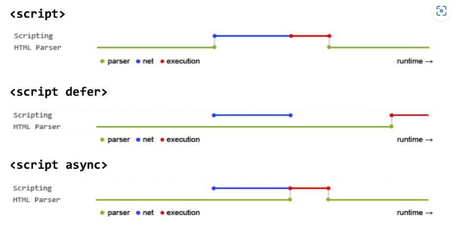

# HTML篇

#### 1. src和href的区别

- src属于对资源的引用，浏览器在解析到该元素时会**暂停其他资源的下载，直到该资源加载完毕**，一般用在<script>和标签中
- href属于超文本引用，当浏览器解析到该元素时会**并行下载资源，不会停止对当前文档的处理**，一般用在<a>标签中

------

#### 2. 对HTML语义化的理解

常见的语义化标签：

```html
<header>头部</header>
<nav>导航栏</nav>
<section>区块</section>
<main>主要区域</main>
<article>主要内容</article>
<aside>侧边栏</aside>
<footer>底部</footer>
```

即：顾名思义的标签，看到标签的名字就知道这个标签是做什么的

语义化的优点如下：

- 利于SEO优化
- 对开发者友好，增强代码的结构和可读性

------

#### 3. DOCTYPE（文档类型）的作用

DOCTYPE是一种在HTML文档开头声明的指令，用于**告知浏览器正在处理文档的类型**（HTML或XHTML），不同的渲染模式会影响浏览器对代码的解析。

浏览器渲染页面的模式可以通过`document.compatMode`来获取，分为以下两种：

- CSS1Compat  标准模式（Strict mode）：浏览器以其支持的最高标准呈现页面
- BackCompat  怪异模式（Quick mode）：页面以一种比较宽松的向后兼容的方式显示

------

#### 4. script标签中defer和async的区别

- defer属性：浏览器遇到带有defer属性的脚本标签时会继续解析HTML文档，在文档解析完成后再异步加载和执行脚本。多个带有defer属性的脚本会按照他们在文档中出现的顺序进行加载。但是不会在`DOMContentLoaded`事件触发前执行，因此脚本不会阻塞文档的解析。
- async属性：浏览器遇到带有async属性的脚本标签时会继续解析HTML文档，并在脚本加载完毕后立即执行，而不会等待其他资源的加载或文档解析。多个带有async属性的脚本会并行加载，并且他们加载完毕后会立刻并行执行，与他们完成加载的顺序无关。

总结：主要区别在于defer脚本会按照顺序加载，并在文档解析完成后执行。而async脚本会并行加载且立刻执行（执行动作会阻塞文档解析）。二者的加载时间都不会阻塞文档的解析。



------

#### 5. 常用的meta标签有哪些

- ```html
  <meta charset="UTF-8">
  ```

  定义网页的字符编码，通常设置为UTF-8

- ```html
  <meta name="viewport" content="width=device-width" initial-scale=1.0>
  ```

  用于响应式网页设计，指定网页在不同的设备上视口的大小和初始缩放比例

- ```html
  <meta name="keywords" content="关键词" />
  ```

  指定网页搜索关键词，利于SEO优化

- ```html
  <meta name="description" content="页面描述内容" />
  ```

  对网页内容的简短描述，显示在搜索引擎结果中，也有利于SEO优化

- ```html
  <meta http-equiv="refresh" content="3;url=https://example.com" />
  ```

  设置自带刷新或重定向页面，content属性中的数字表示延迟时间（秒），后接URL地址

- ```html
  <meta name="robots" content="index,follow" />
  ```

  指示搜索引擎如何处理页面内容，index表示文件将被检索，follow表示页面上的链接可以被查询

------

#### 6. H5的更新

- 语义化标签：`<nav>、<header>、<footer>`等等

- 媒体标签：

  ```html
  <audio src='' controls autoplay loop='true'></audio>   //音频标签
  ```

  ```html
  <video src='' poster='./pciture.jpg' controls></video>   //视频标签
  ```

  ```html
  <video>
   	<source src='video.flv' type='video/flv'></source>
   	<source src='video.mp4' type='video/mp4'></source>
  </video>
  
  //因为浏览器对视频格式支持程度不一样，为了能够兼容不同的浏览器，可以通过source来指定视频源。
  ```

- DOM查询操作：

  > document.querySelector()

  > document.querySelectorAll()

- Web存储：

  > localStorage - 没有时间限制的数据存储

  > sessionStorage - 针对一个 session 的数据存储

- 拖放：拖放是一种常见的特性，即抓取对象以后拖到另一个位置。设置元素可拖放：

  ```html
  
  ```

- 画布（canvas ）： canvas 元素使用 JavaScript 在网页上绘制图像。画布是一个矩形区域，可以控制其每一像素。canvas 拥有多种绘制路径、矩形、圆形、字符以及添加图像的方法。

  ```html
  <canvas id="myCanvas" width="200" height="100"></canvas>
  ```

- SVG：SVG 指可伸缩矢量图形，用于定义用于网络的基于矢量的图形，使用 XML 格式定义图形，图像在放大或改变尺寸的情况下其图形质量不会有损失，它是万维网联盟的标准

------

#### 7.  行内元素有哪些？块级元素有哪些？ 空(void)元素有那些？

- 行内元素：

  `<a>  <b>  <span>    <input>  <select>  <strong>` 

- 块级元素：

  `<div>  <ul>  <ol>  <li>  <h1>  <h2>  <h3>  <h4>  <h5>  <h6>  <p>`

- 空元素（即**没有内容的HTML元素**。空元素是在开始标签中关闭的，也就是空元素没有闭合标签）：

  `<br>  <hr>    <input>  <meta>  <source>  <link>`

------

#### 8. 关于Web Worker

一项用于web应用程序中执行后台任务的技术。简单来说就是**运行在后台的 js，与主线程（通常是页面的UI线程）并行工作**，独立于其他脚本，不会影响页面的性能。

使用方法：

1. 单独创建Woker的脚本文件，用于编写Woker的逻辑代码，例如：woker.js
1. 在主线程中中创建Woker实例，传递Woker脚本文件路径作为参数，例如：`const worker = new Worker('woker.js')`
1. 监听消息和错误：在主线程中使用`onmessage`事件来监听Woker的消息，使用`onerror`事件监听来自Woker的错误
1. 发送消息和错误：在主线程中，使用`woker.postMessage()`方法向Woker发送消息；在Woker内部，使用`self.postMessage()`方法向主线程发送消息。
1. 终止Woker：使用`worker.terminate()`方法来终止Worker的运行

------

#### 9. title与h1的区别、b与strong的区别、i与em的区别？

- title属性没有明确意义,只表示是个标题。h1则表示层次明确的标题，对页面信息的抓取有很大的影响
- b标签只是一个简单的字体加粗标签。strong标签加强字符的语气都是通过粗体来实现的（如果是在盲人模式下语音也会加重），搜索引擎也更侧重strong标签
- i标签内容展示为斜体，主要是视觉上的修饰；em表示强调的文本，浏览器也会以斜体的样式呈现内容，但是使用em更符合H5的语义化的规范

------

#### 10. label 的作用是什么？如何使用？

label标签来定义表单控件的关系：当**用户选择label标签时，浏览器会自动将焦点转到和label标签相关的表单控件上**。

使用方法：

```html
<label for="mobile">Number:</label>
<input type="text" id="mobile"/>
```

或

```html
<label>Number:<input type="text"/></label>
```

具体表现为点击Number字体，输入框将自动获取焦点

------

#### 11.  Canvas和SVG的区别

- 图形渲染方式：SVG使用矢量图形，通过描述图形的形状、路径和属性来渲染图像，基于XML，因此**图形元素可以直接访问和操作**，并且缩放和旋转不会失真；Canvas使用基于像素的绘图，将像素直接渲染到画布上，**需要手动更新和重新绘制**。
- 使用场景：SVG更适合有大型渲染区域的应用程序（如地图），Canvas更适合处理实时生成的图形、游戏和复杂的图像。

------

#### 12.  head 标签有什么作用，其中什么标签必不可少？

head标签用于定义文档的头部，它是所有头部元素的容器。 其中的可以引用脚本等。

可以用在head标签内标签：

`<base> <link> <meta> <script> <style> <title>`

**其中 `<title>` 定义文档的标题，它是 head 部分中唯一必需的元素**

------

#### 13. 渐进增强和优雅降级之间的区别

- 渐进增强（progressive enhancement）：主要是针对低版本的浏览器进行页面重构，保证基本的功能情况下，再针对高级浏览器进行效果、交互等方面的改进和追加功能，以达到更好的用户体验

- 优雅降级（graceful degradation）：一开始就构建完整的功能，然后再针对低版本的浏览器进行兼容。

- 两者区别：

  > - 优雅降级是从复杂的现状开始的，并试图减少用户体验的供给
  > - 渐进增强是从一个非常基础的，能够起作用的版本开始的，并在此基础上不断扩充，以适应未来环境的需要